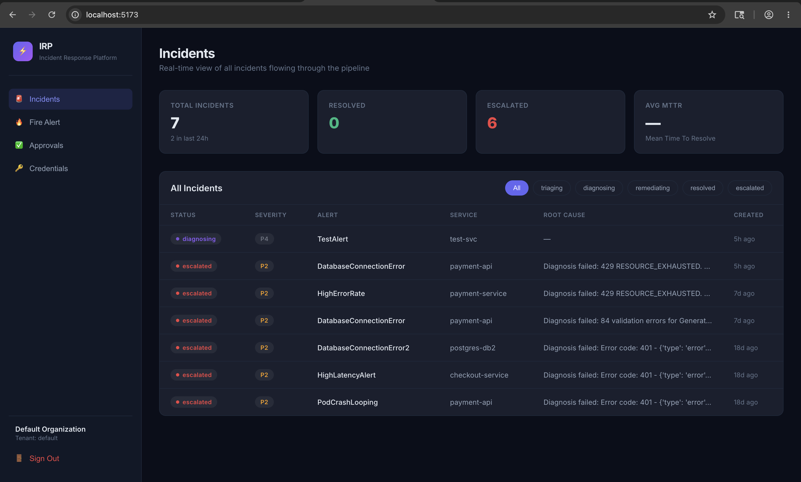
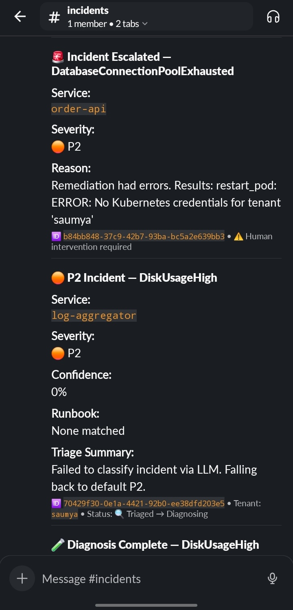
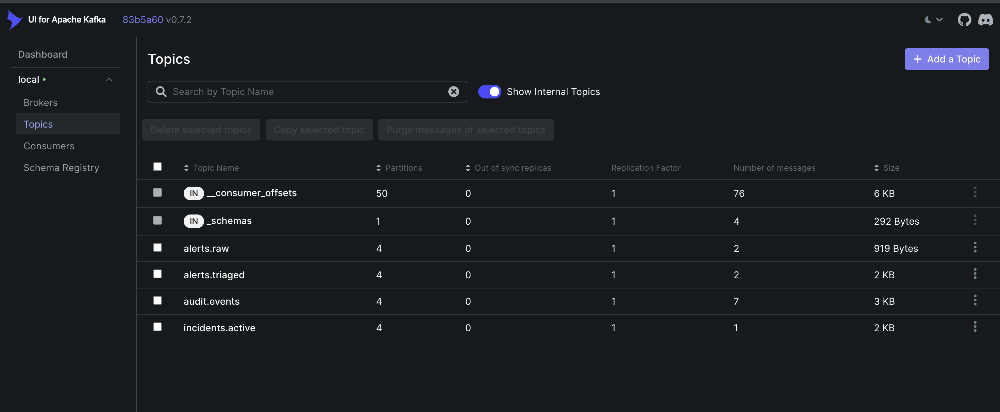
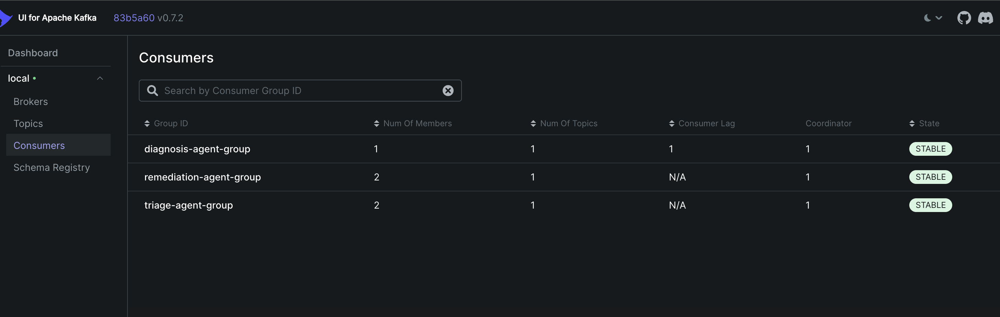

# ⚡ Autonomous Incident Response Platform

An AI-powered, multi-tenant incident response platform that automatically triages, diagnoses, and remediates production incidents — powered by **Google Gemini** and the **Model Context Protocol (MCP)**.

> Fire an alert → watch AI agents triage the severity, diagnose the root cause using live infrastructure data, and execute (or propose for approval) the remediation — all within seconds.

---

## 📸 Screenshots

### Real-Time Dashboard
A single pane of glass to monitor all incidents flowing through the autonomous pipeline. Shows real-time statuses (Triaging, Diagnosing, Remediating, Escalated) and tracks metrics like Mean Time To Resolve (MTTR).



### Slack Integrations & Human-in-the-Loop
Per-tenant Slack notifications formatted with Block Kit. Agents provide detailed summaries of the incident, confidence scores, matched runbooks, and request human approval for high-risk remediation actions.



### Event-Driven Architecture
Powered by Apache Kafka, ensuring decoupled, scalable, and resilient communication between the Alert Ingestor, Triage Agent, Diagnosis Agent, and Remediation Agent.




---

## ✨ Features

- **Autonomous 4-stage pipeline** — Alert Ingestor → Triage → Diagnosis → Remediation
- **Gemini-powered AI agents** — LLM-driven severity classification, root cause analysis, and action planning
- **MCP tool integration** — Agents query live Kubernetes, Prometheus, Loki, and PostgreSQL via Model Context Protocol servers
- **Human-in-the-loop approvals** — HIGH and CRITICAL risk actions require human approval before execution
- **Multi-tenant** — JWT-based auth, all data scoped per tenant
- **Real-time dashboard** — React frontend with live incident tracking, approval management, and credential configuration
- **Slack notifications** — Per-tenant Block Kit alerts at every pipeline stage
- **Vector similarity search** — pgvector for matching alerts to past incidents and runbooks
- **Full observability** — Prometheus metrics, Loki log aggregation, Grafana dashboards

---

## 🏗️ Architecture

```
                          ┌─────────────────────────────────────┐
                          │         React Dashboard (5173)       │
                          │  Incidents │ Fire Alert │ Approvals  │
                          └──────────────────┬──────────────────┘
                                             │ REST
                          ┌──────────────────▼──────────────────┐
                          │      Alert Ingestor API (8000)       │
                          │  /alerts  /dashboard  /approvals     │
                          └──────────────────┬──────────────────┘
                                             │ Kafka
               ┌─────────────────────────────▼──────────────────────────────┐
               │                                                             │
    ┌──────────▼──────────┐              ┌──────────────────────────────────▼┐
    │    Triage Agent      │ →Kafka→      │         Diagnosis Agent           │
    │  (Gemini + pgvector) │              │    (Gemini + 5 MCP tools)        │
    │  Classify severity   │              │    Root cause analysis            │
    └─────────────────────┘              └──────────────────────────────────┬┘
                                                                            │ Kafka
                                         ┌──────────────────────────────────▼┐
                                         │       Remediation Agent           │
                                         │   (Gemini + approval workflow)    │
                                         │   Execute or escalate             │
                                         └───────────────────────────────────┘

    MCP Servers:  k8s(:8001)  db(:8002)  logs(:8003)  metrics(:8004)  remediation(:8005)
    Infra:        Kafka  Redis  PostgreSQL  Prometheus  Grafana  Loki
```

---

## 🚀 Quick Start

### Prerequisites

| Tool | Version |
|------|---------|
| Docker Desktop | Latest |
| Python | 3.12+ |
| Node.js | 18+ |

### 1. Clone & configure

```bash
git clone https://github.com/your-username/incident-response-platform.git
cd incident-response-platform

cp .env.example .env
# Edit .env and add your GEMINI_API_KEY
```

### 2. Start infrastructure

```bash
cd infra
docker compose up -d
```

Starts: **Kafka**, **Zookeeper**, **Redis**, **PostgreSQL** (with pgvector), **Prometheus**, **Grafana**, **Loki**, **Promtail**, and all 5 **MCP servers**.

Wait ~15 seconds for Kafka and Postgres to initialize.

### 3. Activate Python environment

```bash
cd ..
python3 -m venv venv
source venv/bin/activate
pip install -e .
```

### 4. Start the backend services

Open 4 terminals:

```bash
# Terminal 1 — Alert Ingestor (API Gateway)
source venv/bin/activate
cd services/alert-ingestor
PYTHONPATH=../.. uvicorn main:app --port 8000

# Terminal 2 — Triage Agent
source venv/bin/activate
PYTHONPATH=. python3 services/triage-agent/main.py

# Terminal 3 — Diagnosis Agent
source venv/bin/activate
PYTHONPATH=. python3 services/diagnosis-agent/main.py

# Terminal 4 — Remediation Agent
source venv/bin/activate
PYTHONPATH=. python3 services/remediation-agent/main.py
```

### 5. Start the frontend

```bash
cd frontend
npm install
npm run dev
```

Open **http://localhost:5173** → Login with `default` / `admin`

---

## 🔥 Fire Your First Alert

### Via the Dashboard
1. Go to **Fire Alert** in the sidebar
2. Click a preset (e.g. **🔴 P1 — Database Down**)
3. Click **🔥 Fire Alert**
4. Switch to **Incidents** — watch it flow through the pipeline in real time

### Via curl
```bash
curl -X POST http://localhost:8000/alerts/manual \
  -H "Content-Type: application/json" \
  -d '{
    "name": "DatabaseConnectionError",
    "service": "payment-api",
    "environment": "production",
    "summary": "Connection pool exhausted — all 100 connections in use"
  }'
```

---

## 📋 Pipeline Flow

```
1. Alert Ingestor   → Deduplicates, normalizes, publishes to Kafka
2. Triage Agent     → Gemini classifies severity (P1–P4), matches runbooks via pgvector
3. Diagnosis Agent  → Gemini queries live infra (k8s pods, metrics, logs, DB) via MCP
4. Remediation Agent → Gemini plans actions; LOW=auto-execute, MEDIUM/HIGH=human approval
```

---

## 🔑 Environment Variables

Copy `.env.example` to `.env` and configure:

| Variable | Required | Description |
|----------|----------|-------------|
| `GEMINI_API_KEY` | ✅ | Google Gemini API key ([get one here](https://aistudio.google.com/)) |
| `GEMINI_MODEL` | ❌ | Default: `gemini-2.5-flash` |
| `KAFKA_BOOTSTRAP_SERVERS` | ❌ | Default: `localhost:29092` |
| `REDIS_URL` | ❌ | Default: `redis://localhost:6379/0` |
| `POSTGRES_URL` | ❌ | Default: local postgres (from docker compose) |
| `SLACK_BOT_TOKEN` | ❌ | For Slack notifications (`xoxb-...`) |
| `SLACK_INCIDENTS_CHANNEL` | ❌ | Default: `#incidents` |
| `JWT_SECRET_KEY` | ❌ | Change this in production! |

---

## 🌐 Service Ports

| Service | Port | URL |
|---------|------|-----|
| Frontend Dashboard | 5173 | http://localhost:5173 |
| Alert Ingestor API | 8000 | http://localhost:8000/docs |
| K8s MCP Server | 8001 | http://localhost:8001 |
| DB MCP Server | 8002 | http://localhost:8002 |
| Logs MCP Server | 8003 | http://localhost:8003 |
| Metrics MCP Server | 8004 | http://localhost:8004 |
| Remediation MCP Server | 8005 | http://localhost:8005 |
| Kafka UI | 8080 | http://localhost:8080 |
| Prometheus | 9090 | http://localhost:9090 |
| Grafana | 3000 | http://localhost:3000 (admin/admin) |
| Loki | 3100 | http://localhost:3100 |

---

## 📁 Project Structure

```
incident-response-platform/
├── frontend/                    # React dashboard (Vite)
│   └── src/pages/               # Incidents, FireAlert, Approvals, Credentials
├── services/
│   ├── alert-ingestor/          # FastAPI gateway — receives alerts, REST API
│   ├── triage-agent/            # Classifies severity using Gemini + pgvector
│   ├── diagnosis-agent/         # Root cause analysis via MCP tool-calling
│   ├── remediation-agent/       # Plans & executes fixes with approval workflow
│   └── mcp-servers/             # 5 FastMCP servers (k8s, db, logs, metrics, remediation)
├── shared/                      # Shared models, Kafka/Redis/PG clients, config
├── infra/
│   ├── docker-compose.yml       # Full infrastructure stack
│   ├── postgres/init.sql        # Schema with pgvector, runbooks, approvals
│   ├── prometheus/              # Scrape configs
│   └── loki/                    # Log aggregation config
└── pyproject.toml               # Python project + dependencies
```

---

## ✅ Human-in-the-Loop Approvals

When the Remediation Agent generates a **MEDIUM** or **HIGH** risk action:

```
HUMAN_ACTION_REQUIRED — Approve via the Dashboard or API
```

**Via Dashboard:**
1. Click **✅ Approvals** in the sidebar
2. Review the action, risk level, and context
3. Click **Approve** or **Reject**

**Via API:**
```bash
# List pending
curl http://localhost:8000/approvals/pending

# Approve
curl -X POST http://localhost:8000/approvals/{request_id}/approve?approved_by=your-name
```

---

## 🛠️ Tech Stack

| Layer | Technology |
|-------|------------|
| AI / LLM | Google Gemini 2.5 Flash |
| Agent Protocol | Model Context Protocol (MCP) via FastMCP |
| API Gateway | FastAPI + Uvicorn |
| Messaging | Apache Kafka |
| Cache / Dedup | Redis |
| Database | PostgreSQL 16 + pgvector |
| Frontend | React 18 + Vite |
| Observability | Prometheus + Grafana + Loki |

---

## 🤝 Contributing

Contributions are welcome! Please:

1. Fork the repository
2. Create a feature branch (`git checkout -b feat/your-feature`)
3. Commit your changes (`git commit -m 'feat: add your feature'`)
4. Push to the branch (`git push origin feat/your-feature`)
5. Open a Pull Request

Please make sure `.env` is never committed — the `.gitignore` handles this, but double-check.

---

## 🙏 Acknowledgements

- [Google Gemini](https://deepmind.google/technologies/gemini/) — LLM powering all agents
- [Model Context Protocol](https://modelcontextprotocol.io/) — Standardized tool interface for AI agents
- [FastMCP](https://github.com/jlowin/fastmcp) — Python MCP server framework
- [pgvector](https://github.com/pgvector/pgvector) — Vector similarity search in PostgreSQL
